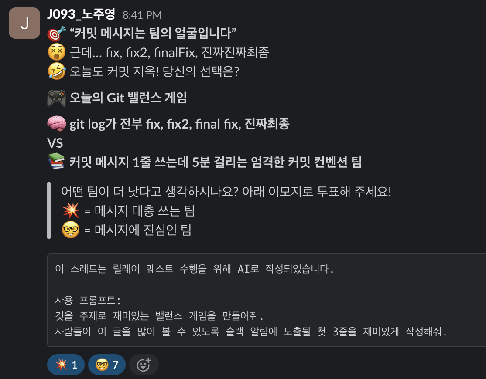
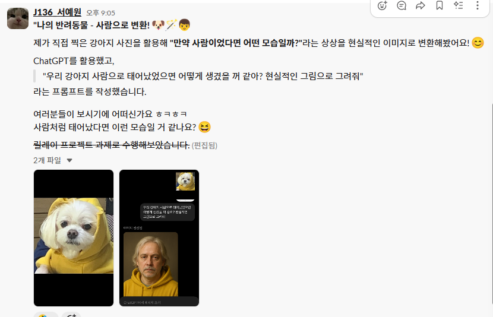
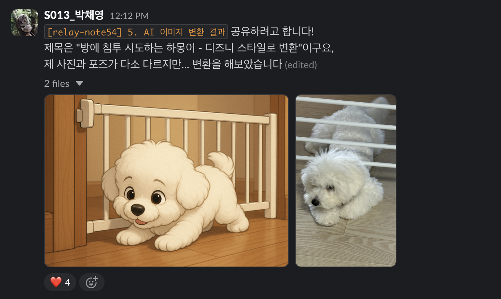

# 2주차 퀘스트 목록

### 1. 사람을 찾습니다 문구 만들어 공유하기

### 제작 배경

챌린지 과정에는 피어 피드백 시간 등 회의에 참석해야하는 시간이 존재합니다. 하지만 많은 사람들이 모인 만큼 그 중 회의를 까먹거나, 지각을 하는 사람들이 생기기 마련이죠. 이럴 때 캠퍼분들은 Slack에 태그와 함께 기다리고 있다는 말을 자주 보내고는 합니다.

특히 최근에는 ‘사람을 찾습니다’채널이 따로 개설되기도 했습니다. 하지만 참여 인원이 현 기준 36명으로 활용하기는 어려운 상황입니다.

### 기획 의도

AI를 사용해 사람을 찾는 문구를 눈에 띄기 쉽도록, 안 보고는 못 지나치도록 만들어봅시다! 해당 내용을 공유하여 필요한 사람들이 복사했다가 사용할 수 있도록 합니다.

### 달성 기준

⚠️ 타 미션과 다르게 최대 한 분만 선택해주세요.

- LLM 등 생성 AI 모델에게 문구 제작을 의뢰합니다.
- 원래의 목적을 다할 수 있도록 눈에 띄지 않는다면 수정을 요청합니다.
- 완성된 텍스트를 Slack 공유합니다.
- 공유할 때는 해당 내용을 공유하는 이유를 간단하게 설명합니다.

---

### 2. **AI 스트레칭 루틴 공유하기**

### 배경

개발자들은 오랜 시간 책상에 앉아 작업하는 경우가 많아 **건강한 신체 루틴**이 필요합니다.

스트레칭은 그런 개발자들에게 어쩌면 필수 요소 일 수 있습니다.

### 목표

AI가 추천하는 간단한 스트레칭 동작을 실천하고, 이를 **가볍게 이모지로 인증하며 루틴화**합니다.

### 기획 의도

- AI를 통해 매번 새로운 스트레칭 동작을 손쉽게 추천받아 **지루하지 않게 실천 가능**
- 동료들이 어떤 동작을 했는지 공유하면서 **자극을 받고 자연스럽게 습관 형성**
- 이모지 인증 방식으로 **진입장벽을 낮추고 참여율을 높임**

### 달성 기준

- 하루에 한 번 이상 **AI로부터 스트레칭 동작을 추천받고 수행**
- 어떤 동작을 했는지 **슬랙에 이모지 또는 간단한 메시지로 인증**

---

### 3. **AI가 추천한 오늘의 CS 문제 요약 공유하기**

### 배경

매일 문제 관련 간단한 CS문제를 AI에게 추천받아 풀어본다면, 문제를 구체적으로 접근하기 전 시작하기 좋을 것입니다.

### 목표

하루에 하나씩, AI가 추천하는 **간단한 CS 문제를 접하고 이를 1문장으로 요약**해 슬랙에 공유합니다.

### 기획 의도

- **네트워크, 운영체제, 자료구조 등** 핵심 CS 개념에 매일 짧게 노출
- 문제 자체를 AI가 제시하므로 **접근성이 높고 반복이 쉬움**
- 공유하는 과정에서 **서로 다른 관점을 비교하고 학습 심화**

### 달성 기준

- AI가 제시한 CS 문제를 **읽고 이해한 뒤**, 핵심 내용을 **1문장으로 요약**
- 요약 내용을 **슬랙에 공유**하여 서로 피드백 받을 수 있는 학습 문화 조성

---

### 4. **AI로 오늘의 미션과 관련된 재미있는 밸런스 게임의 주제를 생성해 공유하기**

### **배경**

- 매일 주어지는 CS 미션은 깊이 있는 학습을 요구하고 개념적인 내용만으로 이해하기 어려울 때가 많습니다.

### 목적

- 이러한 개념들을 비유나 유머를 섞어, 슬랙에서 대화로 풀어내는 과정을 통해 또 다른 형식의 학습을 만들어 내고 슬랙을 활발하게 만들 수 있습니다.

예시)

Day09

스레드 vs 프로세스

Q. 만약 둘 중 하나로 살아야 한다면?

🧍**프로세스: 고립된 공간에서 독립적으로 살아감. 친구는 적지만 책임감은 강함**

vs

🧑‍🤝‍🧑 **스레드: 룸메이트들과 리소스를 공유함. 충돌은 잦지만 친화력 있음**

### 달성 기준

- 주어지는 미션과 관련된 재미있는 밸런스 게임을 만들어 random 채널에 공유해보세요.

---

### 5. AI 이미지 변환 결과 공유하기

### 제작 배경

챌린지를 진행하는 동안 슬랙은 중요한 소통 도구로 활용되고 있지만, 모든 캠퍼가 활발히 사용하는 것은 아닙니다. 슬랙 사용 빈도나 참여도에는 개인차가 존재하죠.

이를 해결하기 위해, 보다 많은 캠퍼들이 흥미롭게 참여할 수 있는 콘텐츠를 슬랙 채널에 유도하고자 이 퀘스트를 기획했습니다.

그중에서도 ‘갤러리 채널’은 친목과 공유 중심의 가벼운 채널로, 이미지 기반 콘텐츠를 통해 더욱 친근하고 자연스럽게 소통할 수 있는 공간입니다.

AI로 변환한 창의적인 이미지와 실제 사진을 함께 공유함으로써, 서로의 감성과 시선을 알아가며 슬랙을 더 재미있고 친근하게 사용할 수 있도록 유도하고자 합니다.

### 목적

- 누구나 쉽게 접근할 수 있는 이미지 생성 AI를 통해 기술을 일상에 자연스럽게 녹여보고, 창의적인 사용법을 함께 나눕니다.
- 나만의 시선을 담은 사진과 AI 변환 결과물을 공유함으로써, 슬랙 채널에서 보다 자유롭고 유쾌한 소통을 유도합니다.
- 서로의 일상, 감성, 창의성을 공유하며 서로를 더 잘 이해하고 친밀한 분위기를 형성합니다.

### 달성 기준

1. 내가 직접 찍은 사진 1장 이상을 준비합니다.
   - 주제 제한 없음 (풍경, 동물, 음식, 일상 등 자유)
2. 사진을 이미지 생성 AI를 사용해 변환합니다.
   - 예: “피카소 스타일로 바꿔줘”, “디즈니풍으로 변환해줘” 등
   - 사용 도구 예시: Bing 이미지 크리에이터, Playground AI, DeepArt 등
3. 원본 사진과 변환된 이미지를 슬랙 갤러리 채널에 함께 공유합니다.
4. 간단한 제목 또는 설명 한 줄을 덧붙입니다.
   - 예: “내 방 창문에서 본 풍경 – 고흐 스타일로 변환!”
5. _(선택)_ 사용한 AI 도구나 프롬프트를 함께 공유하면 다른 사람도 쉽게 따라 할 수 있어요.

---

# 회의 방향

- Readme 정체성을 살리는 방향으로 가되 기존 미션 중 2개는 유지하고 2개정도의 새로운 미션을 추가한다.
  - Slack 활성화에 좋을 것으로 보이는 3, 4번 미션을 유지하고 새로운 미션을 추가해보기.

## 브레인스토밍

기존 기획의도 :**AI를 적극적으로 활용해 슬랙을 보다 활성화할 수 있는 방법을 탐색**

- AI에게 신세한탄하고 slack에 공유하기
  - - 위로의 메시지
      - chat gpt…
- AI에게 밸런스 게임 만들어달라 해서 refresh용으로 공유하기🎖️
- AI에게 Slack 커뮤니티에서 어그로 끌 수 있는 문장 만들어달라 하기
  - 혼날 것 가틈…
- AI에게 날씨, 기분을 고려한 점메추
  - 메뉴 공유하기
- 오늘의 네부캠 챌린지 기사 작성
  - slack 글 정리 느낌
- GPT 먼데이 모델이랑 말싸움하기
- 체크인 멘트 긁어가지고 응원 멘트나 관련 멘트 만들어달라 하기
- 안 보고는 못 지나치는 강렬한 이모티콘과 문구를 포함한 사람을 찾습니다 텍스트 만들기 🎖️
- 자신이 찍은 사진과 AI로 변환한 이미지(피카소 느낌으로 바꿔줘 등) 공유 🎖️

### 1차 주제 선정

- AI에게 밸런스 게임 만들어달라 해서 refresh용으로 공유하기
- 안 보고는 못 지나치는 강렬한 이모티콘과 문구를 포함한 사람을 찾습니다 텍스트 만들기
- 자신이 찍은 사진과 AI로 변환한 이미지(피카소 느낌으로 바꿔줘 등) 공유

### Task

각 퀘스트를 구체화하는 시간.

고려사항

- 퀘스트마다 배경, 목적, 달성 기준을 작성합니다.
- 내가 아닌 모두가 수행하면 좋을 만한 것을 퀘스트로 만들어야 합니다. 아래 내용을 검토해보세요.
  - 실행 가능성: 우리 모두가 할 수 있고, 하면 좋은 퀘스트를 만들어 보세요.
  - 최소한의 기준: 수행 여부를 판단할 수 있는 기준을 포함해야 합니다.
  - 매일 가볍게 실천해서 루틴, 습관화할 수 있는 것이면 좋습니다.
  - 너무 거창하고 어려울 필요가 전혀 없습니다. 모두가 클리어할 수 있는 난이도로 제작해 보세요!
  - 퀘스트를 제작한 배경과 이유, 목적과 달성 기준이 포함되어야 합니다.
- 역할분담
  - 박은지 : 기존 미션 구체화
  - 강성준 : AI 밸런스게임
  - 김태우 : 이미지 변환
  - 전귀로 : 사람을 찾습니다.

---

# 퀘스트 이어 받기

### 🎖️ 퀘스트 선정 결과

| 이름   | 퀘스트 번호 | 선정 이유                                                                                                                                                                                                                                                                                                                                                     |
| ------ | ----------- | ------------------------------------------------------------------------------------------------------------------------------------------------------------------------------------------------------------------------------------------------------------------------------------------------------------------------------------------------------------- |
| 노주영 | 4️⃣          | 얼마 전 random 채널에 AI 사진 vs 실제 사진을 비교하는 밸런스 게임이 올라왔었는데, 미션 수행으로 지쳐있던 기분이 잠시나마 환기되는 기분이 들었습니다. 캠퍼분들도 제가 느꼈던 감정을 체험하길 바라는 마음에 이 주제를 선정하게 되었습니다.                                                                                                                      |
| 모아림 | 2️⃣          | 3개월 전 태어나서 처음으로 pt를 받게 되었습니다. 2개월 차까지는 너무너무 힘들어서 죽을 것 같았는데, 3개월 차가 된 지금은 이전보다 체력이 늘었다는 걸 체감하게 됩니다. (하루 평균 수면시간이 약 4시간이지만, 아직 살아있습니다!!) 그래서 그런지 몸을 쓰는 운동에 대한 관심이 높아졌는데, 2번 미션이 딱 운동과 관련된 퀘스트기에 관심이 가 선택하게 되었습니다! |
| 서예원 | 5️⃣          | 이번 퀘스트를 선택한 이유는 내가 직접 찍은 사진이 AI를 통해 어떻게 변환될지 궁금했고, 나만의 시선을 새로운 방식으로 공유해보고 싶다는 호기심이 컸습니다. 또한 이 퀘스트가 슬랙에서 소통을 시작하는 좋은 계기가 될 것 같아 부담 없이 참여할 수 있겠다고 느꼈습니다. 이미지라는 가볍고 흥미로운 매개체를 통해 다른 캠퍼분들과 자연스럽게 교류하고 싶습니다!     |
| 박채영 | 5️⃣          | 저는 주로 슬랙을 자료 공유나 인사이트 탐색 용도로 사용하다보니 저라는 사람과 관련된 내용을 나눌 기회가 없었습니다. 본 퀘스트를 통해 저의 시선이 담긴 사진을 AI로 변환하여 함께 공유한다면 평소와는 다른 방향으로 슬랙을 사용해볼 수 있을 것 같아 선정하게 되었습니다.                                                                                         |

### 퀘스트 수행 내용

#### ⭐️ 노주영

##### 수행 결과

`메시지 대충 쓰는 팀 vs 메시지에 진심인 팀`을 주제로 한 밸런스 게임을 생성해줬습니다.

> "깃을 주제로 재미있는 밸런스 게임을 만들어줘. 사람들이 이 글을 많이 볼 수 있도록 슬랙 알림에 노출될 첫 3줄을 재미있게 작성해줘."

##### 수행 후 인사이트

“밸런스 게임”이 무엇인지 AI가 이해를 잘 못하는 느낌이었습니다. 밸런스 게임은 의견이 첨예하게 갈리는 주제로 만들어내야 하는데, 이번에 생성해 준 밸런스 게임은 정답이 정해져 있는 듯했습니다.

##### 퀘스트의 개선점

1. 밸런스 게임라는 것이 무엇인지 정확한 맥락을 제공해야 한다.

- 밸런스 게임은 정답을 맞춰야 하는 게임이 아니라, 두가지 옵션을 깊이 고민해봐야 하는 게임이다.
- 댓글로 다른 사람과 열띤 토론이 일어날만한 주제라면 더 좋다.
- 예시: 미지근해지다 못해 따뜻해진 냉면 vs 식어버린 라면

2. 뾰족한 주제를 제공해야 한다.

- 이번 퀘스트에서 사용한 Git 이라는 주제는 너무 광범위하다.
- 주제의 범위를 좁혀서 제공해야 한다.
- 예시: 커밋 메시지 맞춤법, 커밋 메시지 대소문자 취향

위 개선점에서 설명했듯이 AI에게 더 명확한 맥락을 제공해주세요.
꼭 밸런스 게임이 아니어도 좋습니다. 캠퍼들의 관심을 끌만한 아이디어를 생각해주세요.

---

#### ⭐️ 모아림

##### 수행 결과

##### 수행 후 인사이트

매일 반복되는 미션의 해석과 설계, 구현만으로도 하루가 부족하게 느껴집니다. 여기에 운동까지 일상에 추가하는 일은 부담스럽게 느껴질 수밖에 없습니다. 사실 이번 미션을 선택하면서 가장 우려했던 점도 바로 “혹시 고강도 운동을 시키면 어쩌지?”라는 걱정이었습니다. 그러나 역시 AI는 사용자의 상황을 충분히 고려해주는 것 같습니다. 의자에 앉아서 쉽게 따라 할 수 있는 스트레칭을 추천해주었고, 목부터 어깨, 상체, 하체까지 고루 풀어주는 루틴이어서 구성이 정말 마음에 들었습니다.

그동안 저는 늘 “학습”이라는 목적에서만 AI를 활용해왔습니다. 하지만 이번 미션을 진행하면서, 생각보다 AI에게 일상에 밀접한 부분도 충분히 물어볼 수 있다는 점을 새롭게 알게 되었습니다. 그 결과 실제로 도움이 되는 스트레칭 루틴을 얻을 수 있었죠. 어쩌면 스트레칭뿐만 아니라, 앞으로 일상생활의 다양한 개선점에 대해 AI와 상의해볼 수도 있겠다는 생각이 들었습니다.

##### 퀘스트의 개선점

매일 같은 프롬프트를 반복해서 입력하기보다는, 그날그날 내 몸 상태를 구체적으로 설명한 뒤에 스트레칭 루틴을 요청하는 것이 더 효과적이라고 느꼈습니다. 생각보다 AI는 건강과 신체 상태에 대한 지식이 풍부합니다..!!
실제로 “컴퓨터 앞에만 앉아있어. 스트레칭 루틴을 추천해줘”라고만 입력했던 날과 비교해, 아래와 같이 좀 더 구체적으로 요청해보았습니다.

> 요새 매일매일 컴퓨터 앞에만 앉아있다 보니, 승모근이 너무 아파. 뭔가 뭉치는 느낌이야. 이런 나를 위해 하루에 실천할만한 스트레칭 루틴을 추가해줘

그결과 아래 내용과 같이, 보다 목적이 명확하고 자세한 설명이 포함된 스트레칭 루틴을 받을 수 있었습니다. 결국 AI 프롬프트의 핵심은 “얼마나 자세하게 설명하느냐”라는 점이라는 것을 다시 한 번 깨달았습니다.

---

#### ⭐️ 서예원

##### 수행 결과

제가 찍은 저의 반려동물 사진을 ChatGPT에게 사람으로 변환해 그려달라고 부탁했습니다.

> “우리 강아지 사람으로 태어났었으면 어떻게 생겼을 꺼 같아? 현실적인 그림으로 그려줘”

결과 링크: https://boostcampwm10-ch.slack.com/archives/C0956565B4L/p1753963548826369

##### 수행 후 인사이트

예전부터 "우리 반려견이 사람이라면 어떤 모습일까?"라는 상상을 자주 했었는데, 이번 프로젝트를 통해 그 상상이 현실이 되어 마치 하나의 꿈을 이룬 것 같은 기분이었습니다. 💭

또한, 슬랙의 댓글에서 한 분이 "사람의 얼굴을 강아지로 바꾸는 것도 재미있겠다"는 아이디어를 주셨는데, 반대로 시도해보는 것도 흥미로운 결과를 가져왔을 것 같다는 생각이 들었습니다.

##### 퀘스트의 개선점

이미지를 다른 스타일로 변환할 때 단순히 "이 사진을 어떠한 스타일로 바꿔줘"라고 요청하기보다는, "이런 조건을 가진, 이런 스타일로 변환해줘"와 같이 보다 구체적인 조건을 함께 제시하면 원하는 결과에 더 가까운 이미지를 얻을 수 있을 것 같습니다.

(저도 “10대의 모습으로 그려줘”라고 추가 조건을 작성했다면 할아버지가 아니라… 젊은 청년이 그려지지 않았을까 싶습니다.🤣)

---

#### ⭐️ 박채영

##### 수행 결과

AI에게 반려견 사진을 보내고, 디즈니 스타일로 그려달라는 요청을 해보았습니다. 처음에는 AI가 사람으로 인식해서 재요청을 하였는데 이번에는 일반 디즈니 강아지 캐릭터를 그려주어서 구체적으로 요청해야겠다는 생각에 스크립트를 다음과 같이 수정하였습니다.

> "울타리를 기어서 지나치는 이 사진의 포즈와, 비숑 아기 강아지인 점을 잘 반영해서 디즈니풍으로 그려줘"

하지만 사진과 달리 배경이 풀밭이었고, 울타리도 나무 울타리여서 "사진처럼 배경은 실내이고, 울타리는 방문 출입 제한용 흰색 울타리로 그려줘"라는 요구사항을 추가하였습니다. 이에 최종 결과물을 얻을 수 있었습니다.

##### 수행 후 인사이트

AI가 아직까지는 요청의 본질을 파악하고, 정확히 처리하는 능력이 떨어진다는 느낌을 받았습니다. 결국 AI가 임의로 요청을 정의하고 진행한 탓에 원하는 결과를 얻기 힘들었다는 생각이 들었고, 이를 극복하기 위해서는 요청자가 자기가 원하는 결과물의 방향성에 맞게 구체적인 요청을 해야만 한다는 결론에 이를 수 있었습니다

개발 과정에서도 AI로부터 원하는 결과물을 얻기 위해서는 주체적으로 생각하고, 학습하거나 알고 있는 지식을 바탕으로 구체적인 방향을 제시해야만 하며 부스트캠프에서 강조하는 "문제 해결력"이 얼마나 중요한지를 다시금 깨닫게 되는 계기가 된 것 같습니다.

##### 퀘스트의 개선점

재미난 퀘스트이지만 본 퀘스트를 통해 'AI를 사용하는 본질'에 대해서는 생각해보기 어려웠던 것 같습니다. 다음에 이어받는 분께서 이 글을 보시게 된다면 'AI를 사용하는 이유와 그 본질'에 대해서 생각할 수 있는 요소를 추가해주셔도 좋을 것 같습니다.
